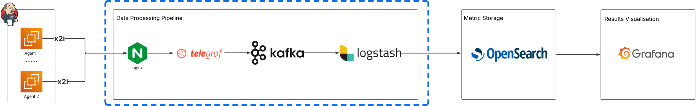

# Performance Data Pipeline

Data pipeline for processing Gatling performance test results.

## Overview

This pipeline processes Gatling simulation.log files from performance tests, transforms the data, and sends it to OpenSearch for storage.



## Components

### 1. Gatling Tests

- The pipeline processes Gatling simulation.log files
- Includes a sample Gatling test for demonstration

### 2. Nginx (Port 8089)

- Serves as the entry point for the pipeline
- Routes Gatling results to Telegraf
- Provides health check endpoints

### 3. Telegraf (Port 8088)

- Collects metrics from Gatling tests
- Processes and transforms the data
- Forwards data to Kafka

### 4. Kafka & Zookeeper

- Provides reliable message queuing
- Decouples the data collection from processing
- Ensures data is not lost during processing

### 5. Logstash

- Consumes data from Kafka
- Processes and transforms the data
- Outputs to OpenSearch
- Performs data enrichment and transformation

### 6. OpenSearch

- External storage 
- Stores performance test results
- Enables powerful querying and analysis
- Supports visualization through dashboards

## Getting Started

### Prerequisites

- Docker and Docker Compose
- OpenSearch cluster (External service)

### Setup

1. Clone repository

2. Make sure OpenSearch is running and accessible
   - The pipeline expects OpenSearch to be available on the network `opensearch_opensearch-net`
   - Default credentials: admin/Developer@123

3. Start the pipeline:
   ```bash
   docker-compose up -d
   ```

4. Verify the services are running:
   ```bash
   docker-compose ps
   ```

### Running Performance Tests

The pipeline includes a sample Gatling test that can be executed:

```bash
docker-compose up gatling-monitoring
```

This will:
1. Start the gatling-publisher to send results to the pipeline
2. Run a sample ComputerDatabaseSimulation test
3. Process the results through the pipeline

## Configuration

### Telegraf

- Configure data collection in `telegraf/telegraf.conf`
- InfluxDB listener configured in `telegraf/inputs.influxdb_listener.8087.gatling_results.conf`
- Kafka output configured in `telegraf/outputs.kafka.conf`

### Logstash

- Pipeline configuration in `logstash/pipeline/kafka_to_file.conf`
- Configure the OpenSearch connection in the output section of the pipeline

### Nginx

- Configuration in `nginx/default.local.conf`
- Handles routing to Telegraf and health checks

## Data Flow

1. Gatling tests send results to Nginx endpoint on port 8089
2. Nginx forwards the data to Telegraf
3. Telegraf processes the data and sends it to Kafka
4. Logstash consumes data from Kafka
5. Logstash processes and enriches the data
6. Logstash sends data to OpenSearch
7. Data can be visualized and analyzed in OpenSearch or Grafana dashboards

## Extending the Pipeline

### Adding Custom Metrics

1. Modify your Gatling tests to include additional metrics
2. Update Telegraf configuration if needed
3. Update Logstash pipeline to process new metrics

### Customizing Data Processing

- Modify `logstash/pipeline/kafka_to_file.conf` to add custom processing logic
- Add custom Telegraf processors in `telegraf/telegraf.conf`

## Troubleshooting

### Common Issues

1. Connectivity problems:
   - Ensure all services are running: `docker-compose ps`
   - Check logs: `docker-compose logs ${service-name}`

2. Data not appearing in OpenSearch:
   - Check Logstash logs: `docker-compose logs logstash`
   - Verify Kafka topics and messages: `docker-compose exec kafka kafka-topics --list --bootstrap-server kafka:9092`

3. Performance tests failing:
   - Check gatling-monitoring logs: `docker-compose logs gatling-monitoring`

## OpenSearch Data Streams

For detailed information on setting up OpenSearch data streams for this pipeline, see the [Data Stream Setup Guide](opensearch/DATASTREAM_SETUP.md).

The data streams configuration provides:
- Separate data streams for requests, tests, and user metrics
- Field mappings for each data type
- Index lifecycle management with hot/warm/cold/delete phases